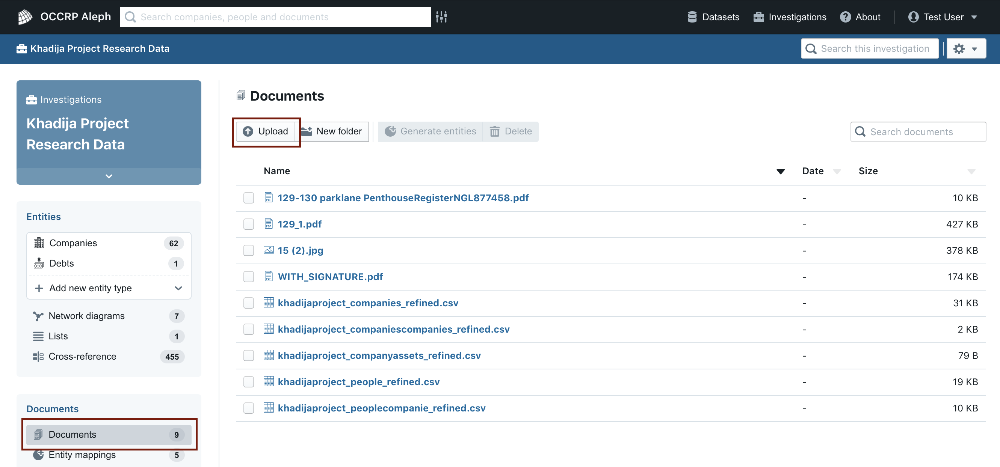
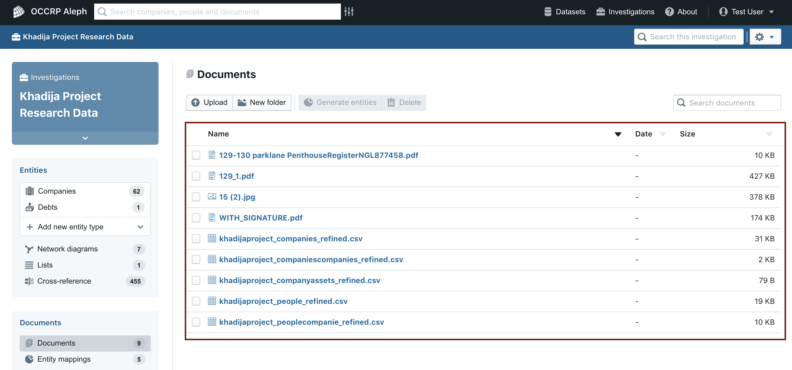

# Uploading documents

The most common type of data to import into an investigation in Aleph is files, such as **PDFs**, **E-Mail archives**, or **Word documents**. Uploading these [documents](../the-basics.md#documents) to Aleph allows you to keep track of evidence gathered over the course of an investigation and to share it as needed with your colleagues.

Most importantly, uploading files to Aleph makes it easier to search their contents, even if text is hidden in images or other unstructured formats.

## Why upload documents to Aleph?

#### Collaboration

Uploading documents to Aleph provides an easy way to **share access** to large sets of documents with your colleagues and collaborators.

#### Text Extraction

Aleph **extracts text** from images and PDF files, allowing you to search for key terms of interest in files that would otherwise prove difficult to search.

#### Names, phone numbers, addresses...

Aleph is trained to recognize and extract mentions of **people**, **companies**, **phone numbers**, **addresses**, and **IBAN numbers** contained in documents you upload, allowing you to easily find other documents containing matching mentions.

#### Email archives

When uploading a set of emails, Aleph automatically extracts structured information like the **sender**, **receiver**, **cc'ed entities**, and **attachments**, making it easy to filter the uploaded data for messages sent from or to a specific person.

.png>)

#### Organized File Structure

Aleph **preserves the folder structure** and hierarchy of uploaded documents, and allows you to create additional folders once files are uploaded into the system. This allows you to keep your files organized as the size of an investigation grows.

## Getting started

To upload a set of documents, you must first have an [investigation](creating-an-investigation.md) into which to import them. Once you have an investigation ready to go, then proceed with the following:

1. From the homepage of your investigation, click the **Documents** button in the sidebar.
2. Then click the **Upload** button to select files or folders from your computer. (Alternatively, **drag** files/folders you would like to upload anywhere onto the screen to start the upload process.)

1. Decide whether you would like to upload documents with their **folder structure intact**, or as a simple list of files.

1. Confirm the files you would like to upload, then click the **Upload** button to start the process.

1. It will take a little while to process your uploaded files. In the meantime, you can check the status of the upload by hovering over the name of your investigation at the top of the screen.

1. When the upload is finished, you should now see your files in the **Documents** section of the investigation.

## Advanced notes on uploads

* To upload a **large trove of documents** (such as a leak), use the command-line based [alephclient tool](../../developers/alephclient.md) to import documents in an automated fashion.
* If you plan to import data **on a recurring basis** from a public source, such as a government web site, you may want to [create a web crawler](../../developers/memorious.md) that automatically executes, collects data and submits them to Aleph.
